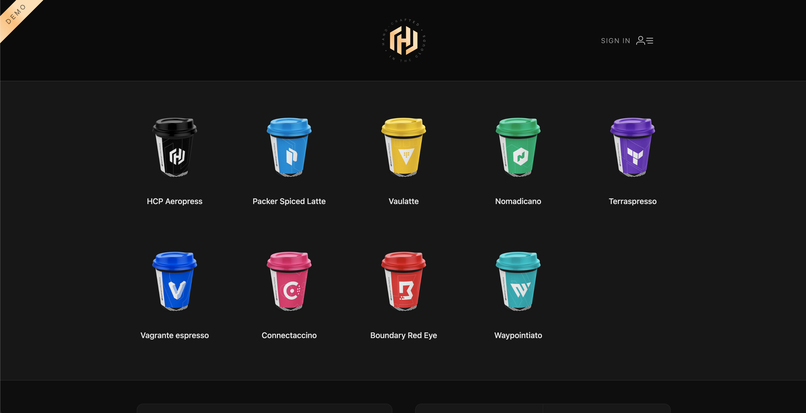
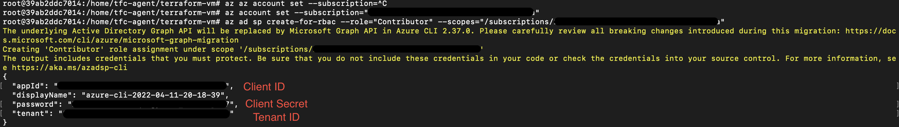
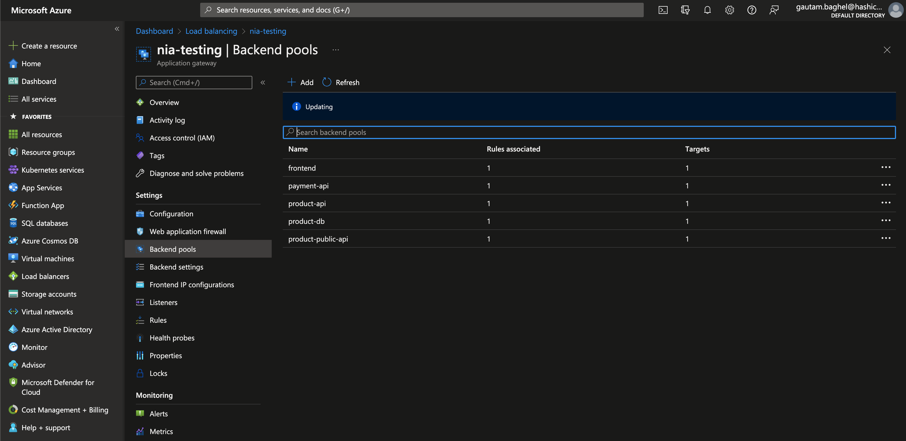
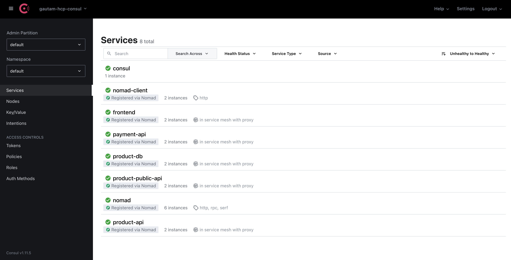
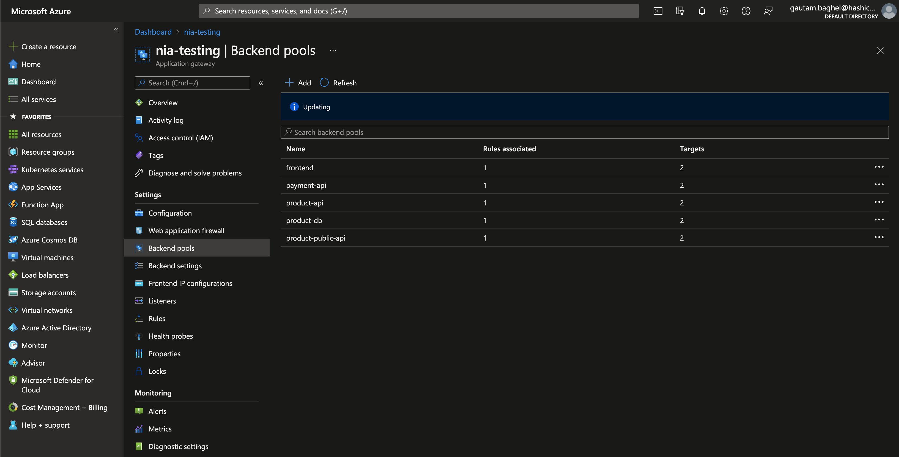

# Consul Terraform Sync for Azure Application Gateway (using HCP Consul)

This module uses service variables from [Consul Terraform
Sync](https://www.consul.io/docs/nia/configuration) to configure an [Azure
application
gateway](https://registry.terraform.io/providers/hashicorp/azurerm/latest/docs/resources/application_gateway).
It's been tested with:

- Consul-Terraform-Sync (CTS) v0.5.2
- Terraform v1.0.8
- HCP Consul v1.11.5

| Requirements | | Providers | |
|------|---------|------|---------|
| Name | Version | Name | Version |
| <a name="requirement_terraform"></a> [terraform](#requirement\_terraform) | >= 1.0 | <a name="provider_azurerm"></a> [azurerm](#provider\_azurerm) | 2.90.0 |
| <a name="requirement_azurerm"></a> [azurerm](#requirement\_azurerm) | >= 2.90 | <a name="provider_azuread"></a> [azuread](#provider\_azuread) | 2.14.0 |
| | | <a name="provider_hcp"></a> [hcp](#provider\_hcp) | 0.26.0 |

## Usage

This repository demonstrates how an Application can be configured to automatically apply network and security infrastructure changes reacting to changes in the Consul service catalog. 

There are 3 steps to achieve this

Step 1: Setup HCP Consul with Azure, create the demo app and register it on HCP Consul

- Create and accept a peering connection between the HVN and VNet
- Create HVN routes that will direct HCP traffic to the CIDR ranges of the subnets.
- Create Azure ingress rules necessary for HCP Consul to communicate to Consul clients.
- Create Azure VM to spin up the demo application and register it on HCP Consul

Step 2: Setup [Consul Terraform Sync](https://www.consul.io/docs/nia/configuration) to watch changes

- Generate CTS config and variables files
- Create Azure VM, copy over the config file and start CTS to monitor Consul

Step 3: Create an additonal instance of the demo app and register with Consul

- Create Azure VM to spin up the demo application and register it on HCP Consul

### Output

- When the second instance is spun and registered with Consul, CTS will automatically detect service catalog changes and update the [Azure application gateway](https://registry.terraform.io/providers/hashicorp/azurerm/latest/docs/resources/application_gateway) backend pools

> Note: This example is not a reflection of a production configuration. Its purpose is to help you test this module for your configurations.

## Setup

### Step 1
1. Go into the `examples/setup/` directory.
   ```shell
   $ cd examples/setup
   ```

> Optional -- If you don't want to use your default public key
2. Generate an SSH key so you can log into the machine under the `./.ssh` directory. Please change the location in `cts.tf` file
   ```shell
   $ ssh-keygen -t rsa -f ./.ssh/id_rsa
   ```

3. Create a HCP Service Key and set the required environment variables

```
export HCP_CLIENT_ID=...
export HCP_CLIENT_SECRET=...
```

4. Log into Azure via the Azure CLI, and set the correct subscription. More details can be found on the [Azure Terraform provider documentation](https://registry.terraform.io/providers/hashicorp/azurerm/latest/docs/guides/azure_cli).

```
az login
az account set --subscription="SUBSCRIPTION_ID"
```

5. Apply the Terraform configuration. This creates a HCP Consul cluster, a VM with hashicups demo app running & registered with Consul and CTS config/var files
```shell
$ terraform init && terraform apply
```

### Output of this step

The HCP Consul cluster can be accessed via the outputs `consul_url` and `consul_root_token`. You can access the HashiCups application by visiting `hashicups_url`

> Optional -- If you want to see nomad and consul client running
You can ssh into the client VM using the Azure public IP and ssh key used 
```shell
  $ ssh adminuser@hashicups_url_ip_address
```


***



You'll notice that you have a few files under `examples/`, which represent a bsic CTS configuration.
   ```shell
   $ ls cts-*
   cts-config-basic.hcl   cts-example-basic.tfvars
   ```

***

> Warning -- Make sure HCP consul and HashiCups are up and running before proceeding to Step 2

### Step 2

1. Create Azure Active Directory Service Principal using the following commands

   ```shell
   az ad sp create-for-rbac --role="Contributor" --scopes="/subscriptions/SUBSCRIPTION_ID"
   ```



2. Set the following environment variables, this is required so that CTS VM can create/update Azure Application Gateway

   ```shell
   export TF_VAR_ARM_CLIENT_SECRET=""
   export TF_VAR_ARM_CLIENT_ID=""
   export TF_VAR_ARM_TENANT_ID=""
   export TF_VAR_ARM_SUBSCRIPTION_ID=""
   ```

3. Uncomment the latter half of `cts.tf` to create the Azure VM and run CTS

   ```shell
   terraform apply
   ```
### Output of this step

Azure Application Gateway will be created if it doesn't already exists




***

### Step 3

1. Uncomment the latter half of `hcp.tf` to create a duplicate VM with HashiCups services registered on Consul

```shell
$ terraform init && terraform apply
```

### Output of this step

> Warning: This can take upto ~15 mins to be updated

Azure Application Gateway's backend pool will be updated




***



### Cleanup

1. SSH into the CTS VM to destroy Azure Application Gateway

   ```shell
   ssh adminuser@CTS_VM_IP_ADDRESS
   ```

2. Go to `terraform-azurerm-application-gateway-nia/examples`.
   ```shell
   cd terraform-azurerm-application-gateway-nia/examples
   ```

3. Delete resources created by CTS.
   ```shell
   ./terraform destroy -auto-approve
   ```

4. Exit the CTS VM
   ```shell
   exit
   ```

4. Delete resources in the example.
   ```shell
   cd examples/setup && terraform destroy -auto-approve
   ```

### Testing the Module

The `tests/` directory includes example service variable definitions under
`fixtures/`. You can check the transformations in the module using the fixtures
in this directory.

However, you will need to generate the following, as they are secrets that get
passed to the module for testing certificates.

- Frontend certificates, like `cts.hashicorp.com.pfx`
- Backend certificates, like `key.pem` or `cert.pem`

### Submodules

The `modules/` directory contains a set of prototype submodules that take an
input and transform the output for use in the main module.

- `backend_http_settings` - a submodule that parses CTS user-defined metadata
  for backend HTTP settings.
- `probe` - a submodule that parses CTS user-defined metadata for custom probe
  configuration.
- `routing/`
    - `basic/` - a submodule that outputs `request_routing_rule`,
      `http_listener` configurations for host-header routing
    - `path_based/` - a submodule that outputs `request_routing_rule`,
      `http_listener`, and `url_path_map` configurations for path-based routing

### Caveats

- Azure Application Gateways handle web traffic (Layer 7).

- This module has not been tested with WAF.

- If you enable a custom probe, the module will [pick the host name from the
  backend
  address](https://docs.microsoft.com/en-us/azure/application-gateway/configuration-http-settings#pick-host-name-from-back-end-address).

- If you use SKU v1, the module will use authentication certificates for backend
  certificates. If you use SKU v2, the module will use trusted root
  certificates. Review
  [documentation](https://docs.microsoft.com/en-us/azure/application-gateway/certificates-for-backend-authentication)
  on backend authentication.

- Custom error configuration is set per `http_listener` on the gateway.

- You cannot define `redirect_configuration`, as they will override the
  CTS-managed addresses in backend pools.

## Modules

| Name | Source | Version |
|------|--------|---------|
| <a name="module_backend_http_settings"></a> [backend\_http\_settings](#module\_backend\_http\_settings) | ./modules/backend_http_settings | n/a |
| <a name="module_basic"></a> [basic](#module\_basic) | ./modules/routing/basic | n/a |
| <a name="module_custom_probes"></a> [custom\_probes](#module\_custom\_probes) | ./modules/probe | n/a |
| <a name="module_path_based"></a> [path\_based](#module\_path\_based) | ./modules/routing/path_based | n/a |

## Resources

| Name | Type |
|------|------|
| [azurerm_application_gateway.service](https://registry.terraform.io/providers/hashicorp/azurerm/latest/docs/resources/application_gateway) | resource |

## Outputs

| Name | Description |
|------|-------------|
| <a name="output_azurerm_application_gateway_id"></a> [azurerm\_application\_gateway\_id](#output\_azurerm\_application\_gateway\_id) | The ID of the Azure application gateway |


## Inputs

| Name | Description | Type | Default | Required |
|------|-------------|------|---------|:--------:|
| <a name="input_autoscale_configuration"></a> [autoscale\_configuration](#input\_autoscale\_configuration) | The autoscaling configuration for SKU v2. Setting autoscale will override `sku_capacity`. | <pre>list(object({<br>    min = number<br>    max = number<br>  }))</pre> | `[]` | no |
| <a name="input_azurerm_private_ip_address"></a> [azurerm\_private\_ip\_address](#input\_azurerm\_private\_ip\_address) | The private IP address to assign to application gateway. Used to configure `frontend_ip_configuration`. | `string` | `null` | no |
| <a name="input_azurerm_public_ip_id"></a> [azurerm\_public\_ip\_id](#input\_azurerm\_public\_ip\_id) | The ID of the Azure public IP address to assign to application gateway. If using SKU v2, you must use a public IP with a `Static` allocation method and `Standard` SKU. Used to configure `frontend_ip_configuration`. | `string` | `null` | no |
| <a name="input_azurerm_resource_group_location"></a> [azurerm\_resource\_group\_location](#input\_azurerm\_resource\_group\_location) | The location of the Azure resource group. | `string` | n/a | yes |
| <a name="input_azurerm_resource_group_name"></a> [azurerm\_resource\_group\_name](#input\_azurerm\_resource\_group\_name) | The name of the Azure resource group. | `string` | n/a | yes |
| <a name="input_azurerm_service_subnet_id"></a> [azurerm\_service\_subnet\_id](#input\_azurerm\_service\_subnet\_id) | The ID of the Azure subnet hosting the application gateway. Used to configure `gateway_ip_configuration` and if applicable, private IP address for `frontend_ip_configuration`. | `string` | n/a | yes |
| <a name="input_backend_certificates"></a> [backend\_certificates](#input\_backend\_certificates) | The authentication (SKU v1) or trusted root (SKU v2) certificates for each backend service, indexed by service name. Used to configure `backend_http_settings`. | <pre>map(list(object({<br>    name = string<br>    data = string<br>  })))</pre> | `{}` | no |
| <a name="input_custom_error_configurations"></a> [custom\_error\_configurations](#input\_custom\_error\_configurations) | The custom error configuration for each backend service, indexed by service name. Used to configure `custom_error_configuration` and `http_listener`. | <pre>map(object({<br>    status_code           = string<br>    custom_error_page_url = string<br>  }))</pre> | `{}` | no |
| <a name="input_enable_http2"></a> [enable\_http2](#input\_enable\_http2) | Enable HTTP2 on the application gateway. Default is `false`. | `bool` | `false` | no |
| <a name="input_enable_path_based_routing"></a> [enable\_path\_based\_routing](#input\_enable\_path\_based\_routing) | Enable `PathBasedRouting` for HTTP listeners and backend address pools. Otherwise, default to `Basic` routing. Used to configure `request_routing_rule`. | `bool` | `false` | no |
| <a name="input_firewall_policy_id"></a> [firewall\_policy\_id](#input\_firewall\_policy\_id) | The ID of the Web Application Firewall Policy. | `bool` | `null` | no |
| <a name="input_frontend_port"></a> [frontend\_port](#input\_frontend\_port) | The frontend port for the Azure application gateway. Default is `80`. | `number` | `80` | no |
| <a name="input_identity_ids"></a> [identity\_ids](#input\_identity\_ids) | The list of single user managed identity IDs to be assigned to the application gateway. Used to configure `identity`. | `list(string)` | `[]` | no |
| <a name="input_name"></a> [name](#input\_name) | The name for resources specific to testing this module. | `string` | n/a | yes |
| <a name="input_private_ip_address_allocation"></a> [private\_ip\_address\_allocation](#input\_private\_ip\_address\_allocation) | The allocation method used for the Private IP Address. Possible values are `Dynamic` and `Static`. Used to configure `frontend_ip_configuration`. | `string` | `null` | no |
| <a name="input_private_link_ip_configurations"></a> [private\_link\_ip\_configurations](#input\_private\_link\_ip\_configurations) | The IP configurations for private link configuration. Used to configure `frontend_ip_configuration` and `private_link_configuration`. | <pre>list(object({<br>    name                          = string<br>    subnet_id                     = string<br>    private_ip_address_allication = string<br>    primary                       = bool<br>    private_ip_address            = string<br>  }))</pre> | `[]` | no |
| <a name="input_services"></a> [services](#input\_services) | The Consul services monitored by Consul-Terraform-Sync | <pre>map(<br>    object({<br>      id        = string<br>      name      = string<br>      kind      = string<br>      address   = string<br>      port      = number<br>      meta      = map(string)<br>      tags      = list(string)<br>      namespace = string<br>      status    = string<br><br>      node                  = string<br>      node_id               = string<br>      node_address          = string<br>      node_datacenter       = string<br>      node_tagged_addresses = map(string)<br>      node_meta             = map(string)<br><br>      cts_user_defined_meta = map(string)<br>    })<br>  )</pre> | n/a | yes |
| <a name="input_sku_capacity"></a> [sku\_capacity](#input\_sku\_capacity) | The capacity of SKU for application gateway if you do not configure autoscaling. Default is `1`. | `number` | `1` | no |
| <a name="input_sku_name"></a> [sku\_name](#input\_sku\_name) | The name of SKU for application gateway. Default is `Standard_v2`. | `string` | `"Standard_v2"` | no |
| <a name="input_sku_tier"></a> [sku\_tier](#input\_sku\_tier) | The tier of SKU for application gateway. Default is `Standard_v2`. | `string` | `"Standard_v2"` | no |
| <a name="input_ssl_certificates"></a> [ssl\_certificates](#input\_ssl\_certificates) | The SSL certificates for each HTTP listener on the application gateway, indexed by service name. Used to configure `ssl_certificate` and `http_listener`. | <pre>map(object({<br>    name                = string<br>    data                = string<br>    password            = string<br>    key_vault_secret_id = string<br>  }))</pre> | `{}` | no |
| <a name="input_tags"></a> [tags](#input\_tags) | The tags to assign to the application gateway. | `map(string)` | `{}` | no |
| <a name="input_url_path_map_default_backend"></a> [url\_path\_map\_default\_backend](#input\_url\_path\_map\_default\_backend) | The default service name for a URL path map when using path-based routing. Otherwise, default to first service listed. Used to configure `url_path_map`. | `string` | `null` | no |
| <a name="input_zones"></a> [zones](#input\_zones) | The collection of availability zones to spread the Application Gateway over. Only valid for SKU v2. | `list(string)` | `[]` | no |

## Outputs

| Name | Description |
|------|-------------|
| <a name="output_azurerm_application_gateway_id"></a> [azurerm\_application\_gateway\_id](#output\_azurerm\_application\_gateway\_id) | The ID of the Azure application gateway |

## CTS User-Defined Metadata Inputs

In order to customize configuration attributes for specific services, this
module will read attributes from [CTS user-defined
metadata](https://www.consul.io/docs/nia/configuration#cts_user_defined_meta).
Below is a list of CTS user-defined metadata you can use to set attributes for
an application gateway.

### Required Metadata

You need to add the following metadata in CTS user-defined metadata for each
service.

| Rule Type | Metadata Key | Description |
| --------- | ----------- | ----------- |
| Basic Routing | `host_name` | Set the host name for each service for basic routing. |
|   | `host_names` | Set the host names for each service with an escaped string that represents a list of hostnames in JSON (e.g, `"[\"*.cts.web.hashicorp.com\"]"`). Only works for SKU v2. [Allows wildcard expressions](https://docs.microsoft.com/en-us/azure/application-gateway/multiple-site-overview#wildcard-host-names-in-listener). |
| Path-Based Routing | `path` | Set the path for each service for path-based routing. |

### Optional Metadata

You can configure optional attributes for backend or probe settings using
metadata.

| Application Gateway Attribute | Metadata Key | Description |
| ----------- | ----------- | ----------- |
| `backend_http_settings` | `backend_path` | The Path which should be used as a prefix for all HTTP requests. |
|   | `backend_cookie_based_affinity` | Set cookie-based affinity to `Enabled` or `Disabled` for service backend. Default is `Disabled`. |
|   | `backend_request_timeout` | Set request timeout for service backend. Default is 60 seconds. |
| `probe` | `probe_enable` | Enable custom probes for service |
|   | `probe_interval` | Set interval for probe. Default is 60 seconds. |
|   | `probe_path` | Set path for probe. Default is `"/"`. |
|   | `probe_timeout` | Set timeout for probe. Default is 60 seconds. |
|   | `probe_unhealthy_threshold` | Set unhealthy threshold for probe. Default is 3. |
|   | `probe_match_body` | Match on string in response body. Default is null to use default status code defined by Azure. |
|   | `probe_match_status_code` | Match on an escaped string that represents a list of status codes in JSON (e.g, `"[\"400-404\"]"`). Default is defined by Azure. |

Other attributes, like certificates, must be defined for each service and passed
by Terraform variable. They _cannot_ be defined by CTS user-defined metadata due
to sensitive or complex values. Attributes that you must define by a Terraform
variable include the following:

- `ssl_certificate`
- `authentication_certificate`
- `trusted_root_certificate`
- `custom_error_configurations`